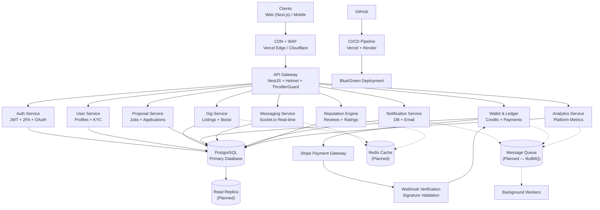
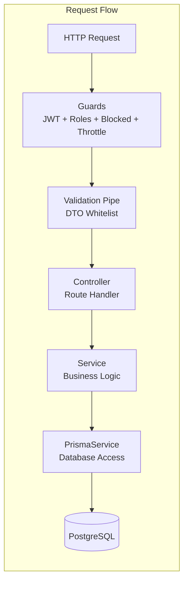
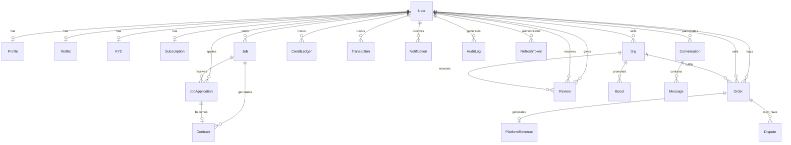
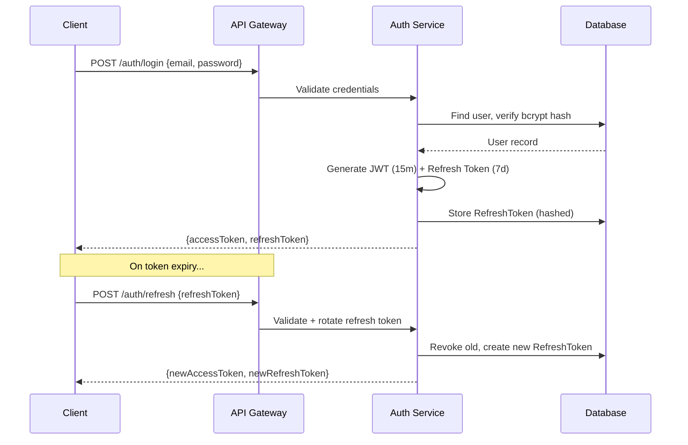
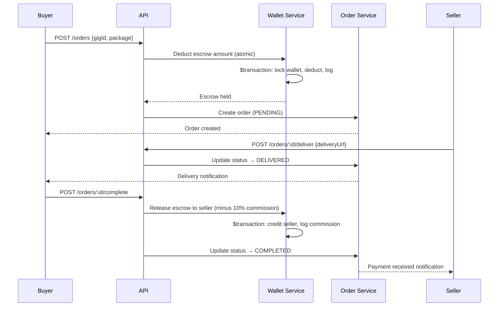
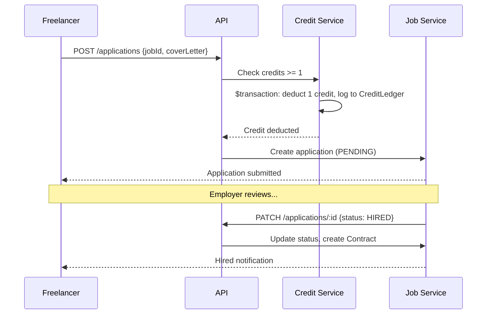
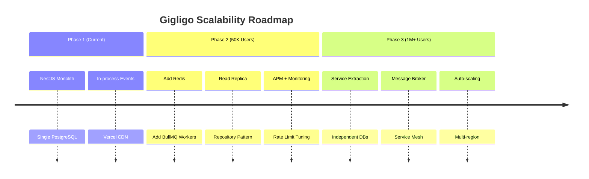

# Gigligo — Production Architecture Document

> **Version**: 1.0 | **Last Updated**: 2026-02-28 | **Status**: Series A Ready
> **Classification**: Internal — Engineering & Investor Due Diligence

---

## 1. System Overview

Gigligo is a dual-sided marketplace connecting freelancers with employers. The platform supports two flows:

- **Gig Marketplace** (Fiverr-style): Sellers list services, buyers purchase via escrow
- **Job Board** (Upwork-style): Employers post jobs, freelancers submit proposals via credits



> **Note**: Dashed lines (`-.->`) represent planned infrastructure for scale phase.

---

## 2. Technology Stack

| Layer | Technology | Purpose |
|---|---|---|
| **Frontend** | Next.js 14 (App Router) | SSR, routing, SEO |
| **Styling** | Tailwind CSS v4 | Design system tokens |
| **Auth (FE)** | NextAuth.js | Session management, OAuth |
| **Backend** | NestJS 10 | Modular REST API |
| **ORM** | Prisma 5 | Type-safe database access |
| **Database** | PostgreSQL 15 | Primary data store |
| **Payments** | Stripe | Checkout, webhooks |
| **Real-time** | Socket.io | Chat messaging |
| **Events** | @nestjs/event-emitter | Internal event bus |
| **Scheduling** | @nestjs/schedule | Cron jobs |
| **Docs** | Swagger/OpenAPI | API documentation |
| **Security** | Helmet, ThrottlerGuard | Headers, rate limiting |
| **Validation** | class-validator | DTO validation |
| **Deployment** | Vercel (FE), Render (BE) | Hosting |

---

## 3. Service Architecture

### 3.1 Service Boundary Definitions

All services follow the **Controller → Service → Database** pattern. Services are stateless NestJS modules communicating via dependency injection and EventEmitter.



### 3.2 Service Map (NestJS Modules → Logical Services)

| Target Service | NestJS Modules | Responsibility |
|---|---|---|
| **Auth Service** | `auth/`, `otp/` | Registration, login, JWT, 2FA, OAuth, refresh tokens |
| **User Service** | `users/`, `profile/`, `kyc/`, `user-state/` | Profiles, KYC verification, user state machine |
| **Gig Service** | `gig/`, `boost/` | Gig CRUD, search, boost/promotion |
| **Proposal Service** | `job/`, `application/`, `contract/` | Job posting, proposals, contracts |
| **Wallet & Ledger** | `wallet/`, `credit/`, `payment/`, `subscription/` | Wallet ops, credits, payments, subscriptions |
| **Messaging Service** | `chat/` | Conversations, messages, Socket.io |
| **Notification Service** | `notification/`, `email/` | DB notifications, email delivery |
| **Reputation Engine** | `review/` | Reviews, ratings, seller levels |
| **Analytics Service** | `analytics/` | Platform metrics, dashboards |

**Supporting Modules**: `admin/`, `referral/`, `newsletter/`, `health/`, `events/`, `ai/`, `mcp/`, `prisma/`, `filters/`, `utils/`

### 3.3 Cross-Cutting Concerns

| Concern | Implementation |
|---|---|
| **Authentication** | `JwtAuthGuard` — validates Bearer token on protected routes |
| **Authorization** | `RolesGuard` — enforces `@Roles()` decorator per-endpoint |
| **Blocked Users** | `BlockedUserGuard` — rejects suspended users globally |
| **Rate Limiting** | `ThrottlerGuard` — 100 requests/min globally |
| **Validation** | `ValidationPipe` — whitelist + transform on all DTOs |
| **Error Handling** | `GlobalExceptionFilter` — standardized error responses |
| **Audit Logging** | `AuditLog` model — tracks admin and sensitive actions |

---

## 4. Database Architecture

### 4.1 Schema Overview



### 4.2 Core Tables (25 Models)

| Domain | Models | Key Constraints |
|---|---|---|
| **Identity** | `User`, `Profile`, `RefreshToken`, `OtpCode` | `email` UNIQUE, `phone` UNIQUE, `nationalId` UNIQUE, `googleId` UNIQUE |
| **Verification** | `KYC` | `userId` UNIQUE — one KYC per user |
| **Marketplace** | `Gig`, `Order`, `Review`, `Boost` | Indexed on `sellerId`, `category`, `isActive` |
| **Job Board** | `Job`, `JobApplication`, `Contract` | `@@unique([jobId, freelancerId])` — one application per job |
| **Financial** | `Wallet`, `CreditLedger`, `Transaction`, `CreditPackage`, `PlatformRevenue` | `userId` UNIQUE on Wallet, immutable ledger entries |
| **Communication** | `Conversation`, `Message`, `Notification` | `@@unique([freelancerId, employerId, orderId])` |
| **Platform** | `Subscription`, `Dispute`, `Referral`, `NewsletterSubscriber`, `AuditLog` | Referral `@@unique([referrerId, refereeId])` |

### 4.3 Financial Safety Rules

```
┌─────────────────────────────────────────────────┐
│              WALLET TRANSACTION FLOW             │
├─────────────────────────────────────────────────┤
│                                                 │
│  1. BEGIN $transaction (Prisma interactive)      │
│  2. SELECT wallet FOR UPDATE (row lock)          │
│  3. Validate balance >= deduction amount         │
│  4. UPDATE wallet SET balance = balance - amount │
│  5. INSERT INTO credit_ledger (immutable log)    │
│  6. INSERT INTO transaction (audit trail)        │
│  7. COMMIT                                       │
│                                                 │
│  ⚠ NEVER trust frontend-supplied balances        │
│  ⚠ NEVER delete ledger entries                   │
│  ⚠ ALL failures → ROLLBACK                      │
└─────────────────────────────────────────────────┘
```

**Implemented safeguards:**
- `prisma.$transaction()` for all wallet mutations
- `CreditLedger` records `balanceAfter` for audit reconstruction
- `Transaction` table logs every money movement with status tracking
- Stripe webhook signature validation before crediting wallets
- 2FA verification required for withdrawals

---

## 5. Authentication & Security Architecture

### 5.1 Auth Flow



### 5.2 Security Layers

| Layer | Protection | Implementation |
|---|---|---|
| **Network** | CDN + WAF | Vercel Edge Network |
| **Transport** | TLS 1.3 | Enforced via HSTS |
| **Headers** | OWASP secure headers | Helmet middleware (CSP, X-Frame-Options, X-Content-Type) |
| **Rate Limiting** | DDoS / brute-force | ThrottlerGuard — 100 req/min global |
| **Authentication** | Identity verification | JWT (RS256) + Refresh Token rotation |
| **Authorization** | Role-based access | 7 roles: FREE, BUYER, SELLER, STUDENT, EMPLOYER, ADMIN, SUPPORT |
| **Validation** | Input sanitization | ValidationPipe with whitelist (strips unknown fields) |
| **CORS** | Origin restriction | Explicit allowlist + Vercel preview regex |
| **2FA** | Account protection | TOTP via authenticator app |
| **KYC** | Identity verification | CNIC + selfie verification with admin approval |
| **Financial** | Transaction safety | Atomic Prisma transactions, webhook signature validation |

### 5.3 OWASP Top 10 Mitigation

| # | Threat | Mitigation |
|---|---|---|
| A01 | Broken Access Control | RolesGuard + BlockedUserGuard on every request |
| A02 | Cryptographic Failures | bcrypt password hashing, JWT signed tokens |
| A03 | Injection | Prisma parameterized queries (no raw SQL) |
| A04 | Insecure Design | Layered architecture, DTO validation |
| A05 | Security Misconfiguration | Helmet defaults, env separation |
| A06 | Vulnerable Components | `npm audit`, locked dependencies |
| A07 | Auth Failures | Refresh token rotation, OTP rate limiting |
| A08 | Data Integrity | Immutable ledger, webhook signatures |
| A09 | Logging Failures | AuditLog model, GlobalExceptionFilter |
| A10 | SSRF | No user-controlled URL fetching |

---

## 6. Data Flow Diagrams

### 6.1 Order & Escrow Flow



### 6.2 Proposal & Credit Flow



---

## 7. Deployment Architecture

```
┌──────────────────────────────────────────────────────┐
│                    PRODUCTION                         │
├──────────────────────────────────────────────────────┤
│                                                      │
│  ┌─────────────┐    ┌─────────────────────────┐     │
│  │  GitHub      │───→│  CI/CD                  │     │
│  │  (main)      │    │  - Lint + Type-check    │     │
│  │  Protected   │    │  - Build verification   │     │
│  └─────────────┘    │  - Deploy on merge      │     │
│                      └─────────┬───────────────┘     │
│                                │                      │
│            ┌───────────────────┼─────────────────┐   │
│            ▼                   ▼                  │   │
│  ┌─────────────────┐  ┌──────────────────┐       │   │
│  │  Vercel          │  │  Render           │       │   │
│  │  (Frontend)      │  │  (Backend)        │       │   │
│  │  Next.js SSR     │  │  NestJS API       │       │   │
│  │  Edge CDN        │  │  Docker Container │       │   │
│  │  Auto SSL        │  │  Auto SSL         │       │   │
│  └─────────────────┘  └──────────────────┘       │   │
│            │                   │                      │
│            └───────────────────┘                      │
│                      │                                │
│            ┌─────────▼──────────┐                    │
│            │  Supabase/Neon     │                    │
│            │  PostgreSQL        │                    │
│            │  Connection Pool   │                    │
│            └────────────────────┘                    │
│                                                      │
└──────────────────────────────────────────────────────┘
```

### 7.1 Environment Strategy

| Environment | Frontend | Backend | Database |
|---|---|---|---|
| **Development** | localhost:3000 | localhost:3001 | Local PostgreSQL |
| **Preview** | Vercel Preview | — | — |
| **Production** | gigligo.com | api.gigligo.com | Managed PostgreSQL |

### 7.2 Deployment Checklist

- [x] Protected `main` branch
- [x] Auto-deploy on merge
- [x] Environment secrets in platform (not repo)
- [x] `.env` in `.gitignore`
- [x] Docker containerization (backend)
- [x] CORS origin allowlist
- [x] Swagger disabled in production
- [ ] PR validation pipeline (planned)
- [ ] Blue/green deployment (planned)
- [ ] Auto rollback (planned)
- [ ] Error monitoring — Sentry (planned)
- [ ] Log aggregation (planned)
- [ ] Uptime alerts (planned)

---

## 8. Performance Requirements

| Metric | Target | Current Strategy |
|---|---|---|
| API Response | < 200ms avg | Indexed queries, Prisma query optimization |
| Page Load | < 2.5s | Next.js SSR, Vercel Edge CDN, code splitting |
| DB Queries | < 50ms | Composite indexes on high-traffic tables |
| WebSocket | < 100ms latency | Socket.io with connection pooling |

### 8.1 Caching Strategy (Planned)

| Data | Cache Layer | TTL | Invalidation |
|---|---|---|---|
| Sessions | Redis | 15 min | On logout/token rotation |
| Gig search results | Redis | 5 min | On gig update |
| Reputation scores | Redis | 1 hour | On new review |
| Static assets | CDN | 1 year | Content-hash URLs |

---

## 9. Scalability Roadmap

### Phase 1: Current (Monolith) — 0–50K Users
- Single NestJS process
- Single PostgreSQL instance
- In-process EventEmitter
- Vercel CDN for frontend

### Phase 2: Scale (Enhanced Monolith) — 50K–500K Users
- Add Redis for caching + sessions
- Add BullMQ for async job processing
- Add PostgreSQL read replica
- Extract repository layer for testability
- Add APM (Application Performance Monitoring)

### Phase 3: Microservices — 500K–1M+ Users
- Extract services into independent deployments
- Replace EventEmitter with message broker (RabbitMQ/Kafka)
- Independent scaling per service
- Service mesh for inter-service communication
- Database per service (eventual consistency)



---

## 10. Monitoring & Observability (Planned)

| Component | Tool | Purpose |
|---|---|---|
| Error Tracking | Sentry | Exception capture, stack traces |
| APM | Datadog / New Relic | Request tracing, DB query timing |
| Logging | Structured JSON logs | Centralized log aggregation |
| Uptime | UptimeRobot / Better Uptime | Availability alerts |
| Metrics | Custom analytics service | Business KPIs dashboard |

---

## 11. Disaster Recovery

| Scenario | Strategy |
|---|---|
| Database failure | Managed PostgreSQL with automated backups (daily) |
| Backend crash | Docker auto-restart, health check endpoint (`/health`) |
| Frontend outage | Vercel edge redundancy, multi-region |
| Payment failure | Webhook retry logic, idempotent operations |
| Data breach | Encrypted KYC, audit logs, incident response plan |

---

*Document prepared for investor due diligence and engineering team onboarding.*
