# Gigligo — Service Map

> Maps the 9 target microservices to current NestJS modules.
> This document serves as the migration guide for eventual service extraction.

---

## Service → Module Mapping

```mermaid
graph LR
    subgraph "Auth Service"
        A1[auth/] --> A2[otp/]
    end

    subgraph "User Service"
        B1[users/] --> B2[profile/]
        B2 --> B3[kyc/]
        B3 --> B4[user-state/]
    end

    subgraph "Gig Service"
        C1[gig/] --> C2[boost/]
    end

    subgraph "Proposal Service"
        D1[job/] --> D2[application/]
        D2 --> D3[contract/]
    end

    subgraph "Wallet & Ledger"
        E1[wallet/] --> E2[credit/]
        E2 --> E3[payment/]
        E3 --> E4[subscription/]
        E4 --> E5[entitlement/]
    end

    subgraph "Messaging"
        F1[chat/]
    end

    subgraph "Notifications"
        G1[notification/] --> G2[email/]
        G2 --> G3[newsletter/]
    end

    subgraph "Reputation"
        H1[review/]
    end

    subgraph "Analytics"
        I1[analytics/]
    end

    subgraph "Platform"
        J1[admin/] --> J2[referral/]
        J2 --> J3[health/]
        J3 --> J4[events/]
        J4 --> J5[ai/]
        J5 --> J6[mcp/]
    end
```

---

## Detailed Service Boundaries

### 1. Auth Service (`auth/`, `otp/`)

| File | Responsibility |
|---|---|
| `auth.controller.ts` | Register, login, refresh, 2FA setup/verify, Google OAuth |
| `auth.service.ts` | Credential validation, token generation, password hashing |
| `jwt.strategy.ts` | JWT extraction and validation strategy |
| `jwt-auth.guard.ts` | Route protection via JWT |
| `roles.guard.ts` | RBAC enforcement via `@Roles()` decorator |
| `roles.decorator.ts` | Custom role metadata decorator |
| `blocked-user.guard.ts` | Suspended user rejection |
| `kyc.guard.ts` | KYC status enforcement |
| `twoFactor.service.ts` | TOTP secret generation, verification |
| `otp/` | Email/phone OTP generation and validation |

**Database Models**: `User` (auth fields), `RefreshToken`, `OtpCode`
**External Dependencies**: bcrypt, jsonwebtoken, speakeasy
**Extraction Notes**: Self-contained, no cross-service mutations. Clean extraction candidate.

---

### 2. User Service (`users/`, `profile/`, `kyc/`, `user-state/`)

| File | Responsibility |
|---|---|
| `users.service.ts` | User CRUD, role management, suspension |
| `profile.service.ts` | Profile creation, update, public profile retrieval |
| `kyc.service.ts` | KYC submission, admin review, status management |
| `user-state.service.ts` | User state machine (KYC + subscription status) |

**Database Models**: `User`, `Profile`, `KYC`, `Experience`, `Education`, `PortfolioItem`
**Extraction Notes**: Profile reads are high-frequency. Cache candidate.

---

### 3. Gig Service (`gig/`, `boost/`)

| File | Responsibility |
|---|---|
| `gig.service.ts` | Gig CRUD, search, filtering, category listing |
| `gig.controller.ts` | REST endpoints for gig operations |
| `boost/` | Gig promotion/boost logic |

**Database Models**: `Gig`, `Boost`
**Extraction Notes**: Search is the heaviest read path. Redis cache critical for scale.

---

### 4. Proposal Service (`job/`, `application/`, `contract/`)

| File | Responsibility |
|---|---|
| `job.service.ts` | Job posting CRUD, search, status management |
| `application.service.ts` | Proposal submission (with credit deduction), status updates |
| `contract.service.ts` | Contract creation from hired applications |

**Database Models**: `Job`, `JobApplication`, `Contract`
**Cross-service Calls**: Credit deduction (Wallet & Ledger), notifications
**Extraction Notes**: Tightly coupled to credit system. Needs event-based decoupling.

---

### 5. Wallet & Ledger Service (`wallet/`, `credit/`, `payment/`, `subscription/`, `entitlement/`)

| File | Responsibility |
|---|---|
| `wallet.service.ts` | Balance management, Stripe checkout, webhook handling, withdrawals |
| `credit.service.ts` | Credit packages, credit deduction, refunds |
| `payment.service.ts` | Payment processing, checkout initiation |
| `subscription.service.ts` | Pro plan management, bonus credits |
| `entitlement.service.ts` | Feature entitlement checks |

**Database Models**: `Wallet`, `CreditLedger`, `CreditPackage`, `Transaction`, `PlatformRevenue`, `Subscription`
**Financial Safety**: All mutations use `prisma.$transaction()`, immutable ledger
**Extraction Notes**: Most critical service. Must maintain ACID guarantees during extraction.

---

### 6. Messaging Service (`chat/`)

| File | Responsibility |
|---|---|
| `chat.gateway.ts` | Socket.io WebSocket gateway |
| `chat.service.ts` | Conversation and message CRUD |
| `chat.controller.ts` | REST endpoints for conversation listing |

**Database Models**: `Conversation`, `Message`
**Extraction Notes**: WebSocket state is the only stateful component. Redis pub/sub needed for multi-instance.

---

### 7. Notification Service (`notification/`, `email/`, `newsletter/`)

| File | Responsibility |
|---|---|
| `notification.service.ts` | Create, read, mark-read DB notifications |
| `email.service.ts` | Transactional email delivery |
| `newsletter.service.ts` | Newsletter subscription management |

**Database Models**: `Notification`, `NewsletterSubscriber`
**Extraction Notes**: Best candidate for async processing via message queue.

---

### 8. Reputation Engine (`review/`)

| File | Responsibility |
|---|---|
| `review.service.ts` | Review submission, average rating calculation |
| `review.controller.ts` | REST endpoints for review CRUD |

**Database Models**: `Review`, `Gig` (avgRating, reviewCount fields)
**Extraction Notes**: Currently stores computed ratings on Gig model. Needs dedicated `ReputationScore` model for cached user-level aggregations.

---

### 9. Analytics Service (`analytics/`)

| File | Responsibility |
|---|---|
| `analytics.service.ts` | Platform metrics aggregation |
| `analytics.controller.ts` | Admin dashboard data endpoints |

**Database Models**: Reads across all models for aggregation
**Extraction Notes**: Read-only service. Best candidate for read replica routing.

---

## Microservice Extraction Priority

| Priority | Service | Reason |
|---|---|---|
| 1 | Notification | Highest decoupling value, async-ready |
| 2 | Analytics | Read-only, safe to extract, benefits from read replica |
| 3 | Messaging | Stateful (WebSocket), benefits from independent scaling |
| 4 | Reputation | Cacheable, low coupling |
| 5 | Gig | High-traffic reads, benefits from caching |
| 6 | Auth | Self-contained, clean boundaries |
| 7 | User | Some cross-service reads needed |
| 8 | Proposal | Coupled to credits, needs event bus first |
| 9 | Wallet & Ledger | Most critical, extract last for safety |
